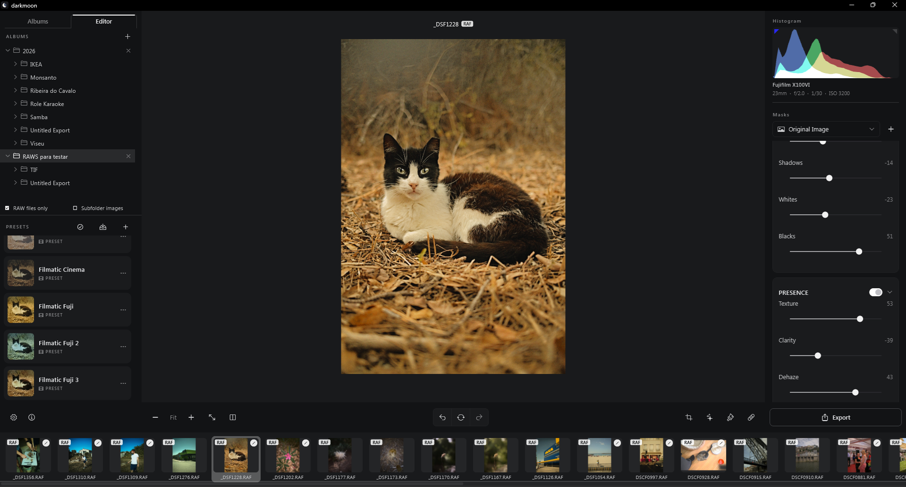
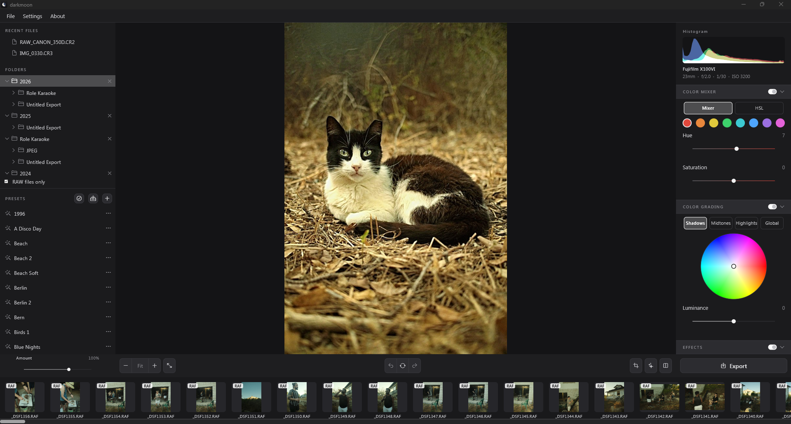

# Darkmoon

A fast, native RAW and JPEG photo editor for Windows — built with Flutter, inspired by Lightroom and Photomator.



## Features

### Import & library

- Open individual RAW files or add whole folders to a persistent library, browsed in a Lightroom-style folder tree
- Supports Canon (CR2/CR3), Nikon (NEF), Sony (ARW), Fujifilm (RAF, including X-Trans sensors), Olympus (ORF), Panasonic (RW2), and DNG
- **Common image formats too** — JPEG, PNG, TIFF, WebP, and BMP go through the exact same editing pipeline as RAW, with an optional "RAW files only" library filter and a type badge on every filmstrip thumbnail
- Fast, parallel thumbnail generation with an on-disk cache
- Automatic per-photo catalog — every edit is saved and restored automatically, no explicit save step

### Editing

- **White Balance** — temperature (Kelvin) and tint, using the camera's own embedded color calibration for accurate, camera-aware color
- **Tone** — exposure, brightness, contrast, highlights, shadows, whites, blacks
- **Presence** — texture, clarity, dehaze, vibrance, saturation
- **Detail** — manual sharpening (amount, radius, detail, masking) plus a one-shot AI-assisted noise reduction pass
- **Tone Curve & Color Curve** — full RGB and per-channel curve editors
- **Color Mixer** — 8-band HSL adjustments
- **Color Grading** — shadows/midtones/highlights/global color wheels
- **Crop & Transform** — straighten, vertical/horizontal/aspect keystone correction, scale, 90° rotation, and a draggable crop overlay with aspect-ratio presets
- **Masking** — Linear Gradient, Radial Gradient, Brush, and Color Range masks, each with independent adjustments, opacity, and an adjustable on-canvas overlay
- **Vignette** — post-crop vignette with amount, midpoint, and feather
- Undo/redo history, before/after comparison, and a live capture-info panel (camera, lens, ISO, shutter, aperture) read straight from each file's metadata

### Presets

- Lightroom-compatible: import `.xmp` presets (single files or `.zip` bundles) and export your own
- Adjustable **Amount** slider blends a preset in at anywhere from 0–150% strength instead of always applying it at full force

### Performance

- Editing runs against a downscaled preview with an even smaller "live" buffer while dragging sliders, so adjustments stay responsive
- Real, stage-based progress bars for RAW decoding, AI denoise, and export — no more guessing whether a long operation is stuck
- Background isolate rendering keeps the UI thread free

### Export

- PNG, TIFF, or JPEG at full resolution, with crop/transform and every mask baked in

### Other

- English and Portuguese interface, following the system language by default



## Getting started

Requires Windows with the Flutter SDK installed.

```powershell
cd flutter_app
flutter pub get
flutter run -d windows
```

To build a release executable:

```powershell
cd flutter_app
flutter build windows --release
```

The built app lands in `flutter_app\build\windows\x64\runner\Release\`.

## Tech stack

- **Flutter** (Windows desktop) for the UI
- **LibRaw** via Dart FFI for RAW decoding and metadata
- **`package:image`** for common image format decoding and encoding
- Custom Dart render pipeline for every color/tone adjustment, geometric transform, and mask
