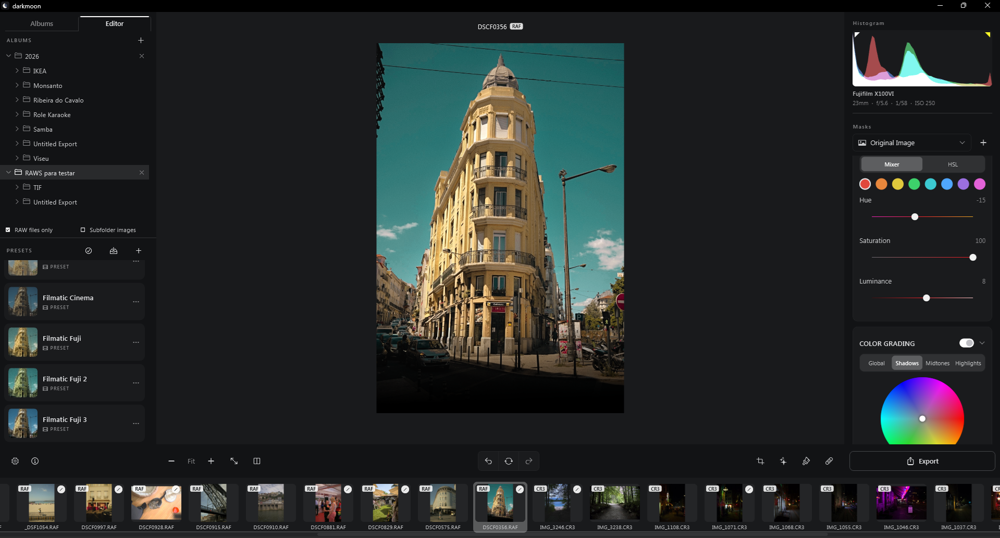

# darkmoon

A fast, native RAW and JPEG photo editor for Windows and Linux — built with Flutter, inspired by the best desktop RAW editors.


## Features

### Import & library

- Open individual RAW files or add whole folders to a persistent library, browsed in a familiar folder tree
- Supports Canon (CR2/CR3), Nikon (NEF), Sony (ARW), Fujifilm (RAF, including X-Trans sensors), Olympus (ORF), Panasonic (RW2), and DNG
- **Common image formats too** — JPEG, PNG, TIFF, WebP, and BMP go through the exact same editing pipeline as RAW, with an optional "RAW files only" library filter and a type badge on every filmstrip thumbnail
- Fast, parallel thumbnail generation with an on-disk cache
- Automatic per-photo catalog — every edit is saved and restored automatically, no explicit save step

### Editing

- **White Balance** — temperature (Kelvin) and tint, using the camera's own embedded color calibration for accurate, camera-aware color
- **Tone** — exposure, brightness, contrast, highlights, shadows, whites, blacks
- **Presence** — texture, clarity, dehaze, vibrance, saturation
- **Detail** — manual sharpening (amount, radius, detail, masking) plus AI-assisted noise reduction: a classic per-render pass, an on-device neural Enhance (denoise + optional 2x upscale, including a raw-domain Bayer-sensor model), or a paid Cloud AI provider of your choice (Topaz Labs, OpenAI, Gemini)
- **Lens Correction** — automatic distortion, vignette, and chromatic-aberration correction matched against a bundled Lensfun-style profile database
- **Tone Curve & Color Curve** — full RGB and per-channel curve editors
- **Color Mixer** — 8-band HSL adjustments
- **Color Grading** — shadows/midtones/highlights/global color wheels, each with Hue/Saturation/Luminance sliders for precise input alongside the wheel
- **Crop & Transform** — straighten, vertical/horizontal/aspect keystone correction, scale, 90° rotation, and a draggable crop overlay with aspect-ratio presets
- **Masking** — Linear Gradient, Radial Gradient, Brush, Flow (pressure-style incremental brush), Color Range, and Luminance Range masks, each with independent adjustments, opacity, and an adjustable on-canvas overlay
- **Vignette** — post-crop vignette with amount, midpoint, and feather
- Optional GPU-accelerated rendering for the editing preview, with automatic CPU fallback
- Undo/redo history, before/after comparison, and a live capture-info panel (camera, lens, ISO, shutter, aperture) read straight from each file's metadata

### Presets

- Import `.xmp` presets (single files or `.zip` bundles) and export your own
- Adjustable **Amount** slider blends a preset in at anywhere from 0–150% strength instead of always applying it at full force

### Performance

- Editing runs against a downscaled preview with an even smaller "live" buffer while dragging sliders, so adjustments stay responsive
- Real, stage-based progress bars for RAW decoding, AI denoise, and export — no more guessing whether a long operation is stuck
- Background isolate rendering keeps the UI thread free

### Export

- PNG, TIFF, or JPEG at full resolution, with crop/transform and every mask baked in

### Other

- English, Portuguese, and German interface, following the system language by default
- Interface animations (panel transitions, zoom, fade-in previews) — on by default, with a one-switch off in Settings



## Getting started

### Windows

Requires the Flutter SDK installed.

```powershell
cd flutter_app
flutter pub get
flutter run -d windows
```

To build a release executable:

```powershell
cd flutter_app
flutter build windows --release
```

The built app lands in `flutter_app\build\windows\x64\runner\Release\`.

### Linux

Newer and less polished than Windows — no native splash screen yet, and
Cloud AI (Topaz/OpenAI/Gemini) API tokens don't persist across launches.
See the [v1.5.0 release notes](https://github.com/vinioliveiras/darkmoon/releases/tag/v1.5.0)
for the current gaps.

Unlike Windows, the native libraries aren't bundled in the repo — you'll
need a `libraw_r.so` and `libonnxruntime.so`/
`libonnxruntime_providers_shared.so` under `flutter_app/linux/native/`
first. See that folder's [README](flutter_app/linux/native/README.md) for
where to get them (LibRaw is built from source; ONNX Runtime is the
official prebuilt release — neither is a big undertaking, just not a
single command).

```bash
cd flutter_app
flutter pub get
flutter build linux --release
```

The built app lands in `flutter_app/build/linux/x64/release/bundle/`.

## Tech stack

- **Flutter** (Windows and Linux desktop) for the UI
- **LibRaw** via Dart FFI for RAW decoding and metadata
- **`package:image`** for common image format decoding and encoding
- **ONNX Runtime** via Dart FFI for on-device AI denoise/upscale
- Custom Dart render pipeline for every color/tone adjustment, geometric transform, and mask, with an optional GPU (fragment shader) path

## Website

[`docs/index.html`](docs/index.html) is the project's landing page (a single
static file, no build step — open it directly or serve `docs/` with GitHub
Pages). It's marketing content, not part of the app, and isn't covered by
the license below.

## Donate

Please help me keep this project going – it’s a one-man project
[https://ko-fi.com/vinioliveira](https://ko-fi.com/vinioliveira)

## License

The app (everything outside `docs/`) is licensed under
[AGPL-3.0](LICENSE).
